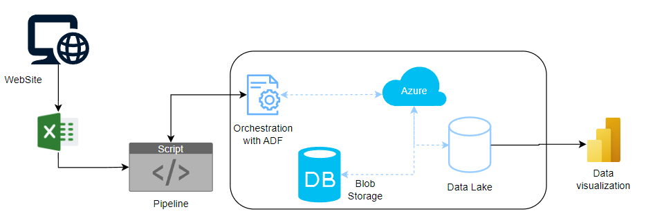

# Boston.gov Data Download and Upload Pipeline

This pipeline automates the process of downloading CSV files from the Boston Open Data website, compressing them into a single ZIP file, and uploading it to an Azure Blob Storage container.

## Process Overview

1. **Data Download:**
   - The pipeline starts by downloading multiple CSV files containing annual data from the Boston Open Data website.
   - Each year has a separate CSV file, from 2015 to 2025.

2. **Directory Creation:**
   - The script checks if a `Data` directory exists and creates it if necessary to store the downloaded files.

3. **Downloading and Saving Files:**
   - Using the `requests` library, the CSV files are downloaded from the provided URLs and saved in the `../Data` directory.

4. **File Compression:**
   - After downloading the CSV files, all files are compressed into a single ZIP file using the `shutil` module.

5. **Upload to Azure Blob Storage:**
   - The generated ZIP file is uploaded to an Azure Blob Storage container using the `BlobServiceClient` from the Azure SDK.
   - Authentication for Azure Blob Storage is done via account keys stored in a `.env` file.

## Requirements

- Python 3.x
- Python libraries:
  - `requests`
  - `os`
  - `shutil`
  - `azure-storage-blob`
  - `python-dotenv`

## How to Use

1. **Environment Setup:**
   - Create a `.env` file in the project root and add your Azure Blob Storage account authentication details:
     ```
     ACCOUNT_KEY=<your-account-url>
     AZURE_KEY=<your-account-key>
     ```

2. **Run the Pipeline:**
   - To run the pipeline, simply execute the Python script:
     ```bash
     python your_script.py
     ```

3. **Check Azure Blob Storage:**
   - After execution, the ZIP file containing the data will be uploaded to the specified container.

## Architecture Diagram

  


## Notes

- The pipeline is designed to download and upload annual data from 2015 to 2025.
- Ensure that your Azure account credentials are correctly set in the `.env` file to ensure successful data upload.
